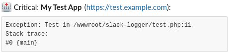

# Slack Logger
Send errors/notices/warnings etc to slack,
using this Class which implements the Prs/Log/LoggerInterface.

For more information about the logger interface or log levels see [their github](https://github.com/php-fig/fig-standards/blob/master/accepted/PSR-3-logger-interface.md).

## Setup webhook
Before you can use this you need to setup a webhook app in slack and connect this to the channel you want to use.

1. Goto [https://api.slack.com/apps](https://api.slack.com/apps).
2. Click on the "New App" button on the top right.
3. Fill in a "App Name" (this will be the sender name in slack)
4. Fill in on which "Development Slack Workspace" you want to have it installed.
5. Click on "Create App".
6. In section "Add features and functionality" select "Incoming Webhooks".
7. Set "Activate Incoming Webhooks" to "On" on the right.
8. This will unfold new options and now click on "Add New Webhook to Workspace" on the bottom of the page.
9. This will bring you to a new page, select on which channel you want the message to be posted.
10. Click on "Install".
11. This will bring you back to the webhook page, now on the bottom of the page copy the webhook url. This url is what you need in below example.

## Example
```php
<?php

$slack = new \Devorto\Logger\Slack(
	'<paste-webhook-url-here>',
	'My Test App',
	'https://test.example.com' // Optional app url.
);

// Use one of the available log level methods:
$slack->critical('Help something went critical.');

// You can also drop an Exception in here.
$slack->critical(new Exception('Test'));
```
Produces this in slack:

